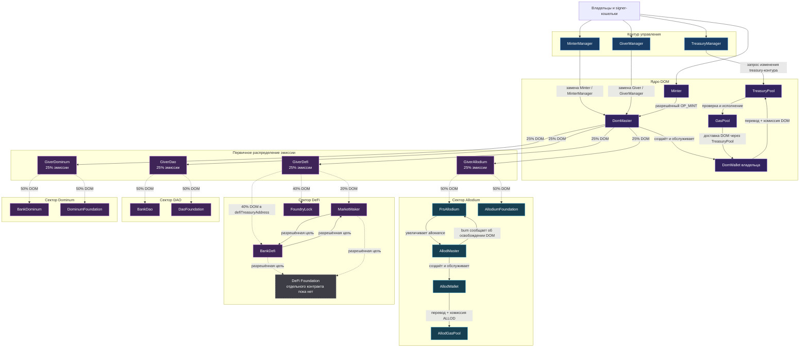
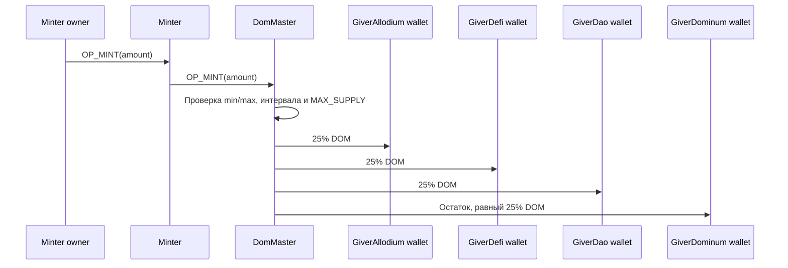
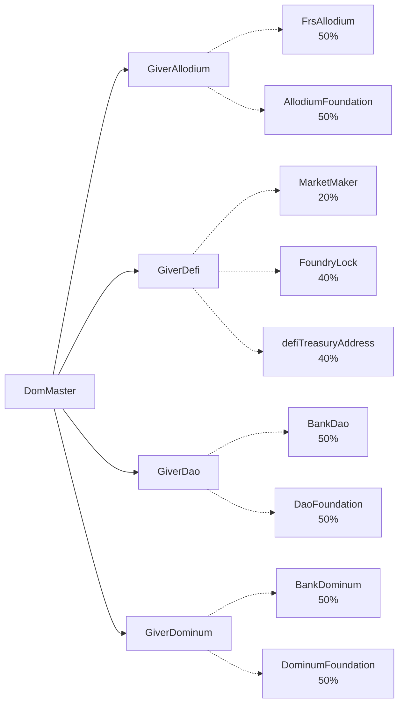
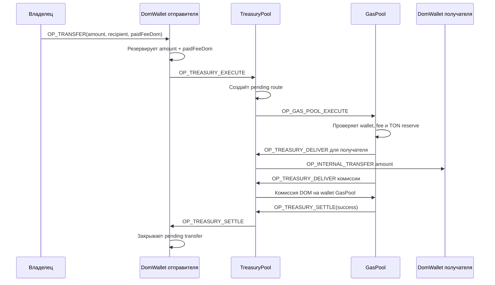
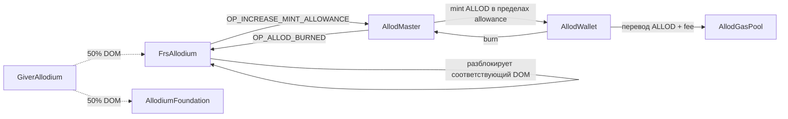

# Архитектура смарт-контрактов Dominum / Allodium

> Цифровая схема контрактов построена по текущему рабочему дереву проекта
> `C:\projects\DAO` на 23 июня 2026 года.
>
> Схема отражает фактический код, включая незакоммиченные изменения.
> Пунктиром отмечены контракты и связи, которые существуют в коде,
> но пока подключаются через временные placeholder-адреса.

## Условные обозначения

- Сплошная стрелка — действующая связь в текущем коде.
- Пунктирная стрелка — предусмотренная связь через placeholder или будущую конфигурацию.
- `DOM` — jetton Dominum.
- `ALLOD` — jetton Allodium.
- `TON` — нативная монета сети TON, используемая для газа и резервов.
- Каждый контракт, который хранит DOM, владеет отдельным `DomWallet`.

## 1. Общая карта системы

Источники общей карты:

- Роли `DomMaster`: `contracts/Dominum/dom/master.tolk:19-37`.
- Распределение эмиссии по четырём giver: `contracts/Dominum/dom/master.tolk:324-351`.
- Доли `25 / 25 / 25 / 25`: `contracts/Dominum/core/constants.tolk:17-22`.
- Управляющие запросы: `contracts/Dominum/management/treasury_manager.tolk:24-122`,
  `contracts/Dominum/management/minter_manager.tolk:28-126`,
  `contracts/Dominum/management/giver_manager.tolk:24-126`.

## 2. Выпуск DOM

`Minter` не выпускает DOM самостоятельно. Он проверяет своего владельца
и отправляет разрешённый `OP_MINT` в `DomMaster`.

Источники:

- `Minter → DomMaster`: `contracts/Dominum/treasury/minter.tolk:27-50`,
  `contracts/Dominum/treasury/minter.tolk:53-90`.
- Проверки и выпуск в `DomMaster`: `contracts/Dominum/dom/master.tolk:285-351`,
  `contracts/Dominum/dom/master.tolk:354-390`.
- Тестовый интервал минта — 3600 секунд:
  `contracts/Dominum/core/constants.tolk:34-38`.

## 3. Автоматическое распределение giver-контрактами

После получения `OP_TRANSFER_NOTIFICATION` каждый giver автоматически
распределяет DOM. Перед делением удерживается резерв комиссии
`GIVER_MAX_FEE_DOM`.

Источники:

- Allodium `50 / 50`: `contracts/Dominum/givers/giver_allodium.tolk:88-99`.
- DeFi `20 / 40 / 40`: `contracts/Dominum/givers/giver_defi.tolk:95-108`.
- DAO `50 / 50`: `contracts/Dominum/givers/giver_dao.tolk:88-99`.
- Dominum `50 / 50`: `contracts/Dominum/givers/giver_dominum.tolk:88-99`.
- Адрес кошелька giver теперь строится с `treasuryPoolAddress`:
  `contracts/Dominum/givers/giver_allodium.tolk:10-35`,
  `contracts/Dominum/givers/giver_defi.tolk:15-42`,
  `contracts/Dominum/givers/giver_dao.tolk:10-35`,
  `contracts/Dominum/givers/giver_dominum.tolk:10-35`.

## 4. Маршрут обычного перевода DOM

Если операция отклонена или сообщение bounce-ится, pending-перевод
в `DomWallet` восстанавливается.

Источники:

- Начало перевода и резерв баланса:
  `contracts/Dominum/dom/wallet.tolk:278-323`.
- Маршрутизация через `TreasuryPool`:
  `contracts/Dominum/treasury/treasury_pool.tolk:470-558`,
  `contracts/Dominum/treasury/treasury_pool.tolk:561-606`.
- Проверка и выполнение в `GasPool`:
  `contracts/Dominum/pools/gas_pool.tolk:101-158`,
  `contracts/Dominum/pools/gas_pool.tolk:208-266`.
- Обработка успешного и неуспешного завершения:
  `contracts/Dominum/dom/wallet.tolk:195-259`.

### Текущая газовая топология

`GasRouter` удалён из текущего рабочего дерева. Постоянной точкой входа
для DOM-кошельков является `TreasuryPool`, который хранит изменяемый
`gasPoolAddress` и напрямую передаёт выполнение в `GasPool`.

Источники:

- Прямой маршрут `TreasuryPool → GasPool`:
  `contracts/Dominum/treasury/treasury_pool.tolk:487-505`.
- Создание связки `TreasuryPool ↔ GasPool`:
  `scripts/Dominum/foundation/deployInfrastructure.ts:59-139`.

## 5. Экономический цикл Allodium

`FrsAllodium` является резервным контуром:

1. Получает и блокирует DOM.
2. Увеличивает лимит выпуска ALLOD.
3. После burn ALLOD уменьшает резерв и возвращает соответствующий DOM.

Курс в текущих константах: `100 DOM → 100 ALLOD`, то есть базовое
соотношение после учёта `EXCHANGE_DECIMALS_FACTOR` равно `1 : 1`.

Источники:

- Приём DOM и выдача allowance:
  `contracts/Allodium/treasury/frs_allodium.tolk:103-143`.
- Burn ALLOD и разблокировка DOM:
  `contracts/Allodium/treasury/frs_allodium.tolk:147-168`.
- Ограниченный allowance mint:
  `contracts/Allodium/allod/master.tolk:166-217`.
- Уведомление FRS после burn:
  `contracts/Allodium/allod/master.tolk:221-257`.
- Курс: `contracts/Allodium/core/constants.tolk:11-14`.

## 6. Реестр контрактов

| Домен | Контракт | Файл | Назначение |
|---|---|---|---|
| DOM | DomMaster | `contracts/Dominum/dom/master.tolk:14-37` | Эмиссия DOM, роли minter/giver и код кошелька |
| DOM | DomWallet | `contracts/Dominum/dom/wallet.tolk:19-26` | Баланс DOM и pending-переводы |
| Treasury | Minter | `contracts/Dominum/treasury/minter.tolk:5-9` | Разрешённый вход для минта |
| Treasury | TreasuryPool | `contracts/Dominum/treasury/treasury_pool.tolk:15-38` | Маршрутизация переводов, treasury и gas-конфигурация |
| Management | MinterManager | `contracts/Dominum/management/minter_manager.tolk:5-8` | Запрос замены Minter и самого manager |
| Management | GiverManager | `contracts/Dominum/management/giver_manager.tolk:5-24` | Запрос замены giver и самого manager |
| Management | TreasuryManager | `contracts/Dominum/management/treasury_manager.tolk:5-24` | Запрос изменения treasury-адресов и налога |
| Gas | GasPool | `contracts/Dominum/pools/gas_pool.tolk:5-14` | Проверка комиссии и оплата TON выполнения |
| Distribution | GiverAllodium | `contracts/Dominum/givers/giver_allodium.tolk:10-15` | Делит сектор Allodium между FRS и foundation |
| Distribution | GiverDefi | `contracts/Dominum/givers/giver_defi.tolk:15-21` | Делит сектор DeFi между market, foundry и treasury |
| Distribution | GiverDao | `contracts/Dominum/givers/giver_dao.tolk:10-15` | Делит сектор DAO между bank и foundation |
| Distribution | GiverDominum | `contracts/Dominum/givers/giver_dominum.tolk:10-15` | Делит сектор Dominum между bank и foundation |
| DAO | BankDao | `contracts/Dominum/banks/bank_dao.tolk:24-31` | Управляемое хранилище DOM/TON с whitelist |
| DAO | DaoFoundation | `contracts/Dominum/foundation/dao_foundation.tolk:28-35` | Фонд DAO с whitelist |
| DeFi | BankDefi | `contracts/Dominum/banks/bank_defi.tolk:22-31` | Банк DeFi, связанный с MarketMaker и foundation |
| DeFi | MarketMaker | `contracts/Dominum/defi/market_maker.tolk:11-18` | Операционный контракт рынка |
| DeFi | FoundryLock | `contracts/Dominum/invest/foundry_lock.tolk:18-28` | Помесячная блокировка DOM |
| Dominum | BankDominum | `contracts/Dominum/banks/bank_dominum.tolk:15-19` | Банк Dominum и резерв GasPool |
| Dominum | DominumFoundation | `contracts/Dominum/foundation/dominum_foundation.tolk:23-30` | Фонд Dominum с whitelist |
| Allodium | FrsAllodium | `contracts/Allodium/treasury/frs_allodium.tolk:13-18` | DOM-резерв и allowance для ALLOD |
| Allodium | AllodMaster | `contracts/Allodium/allod/master.tolk:16-25` | Эмиссия ALLOD в пределах allowance |
| Allodium | AllodWallet | `contracts/Allodium/allod/wallet.tolk:21-28` | Баланс и переводы ALLOD |
| Allodium | AllodGasPool | `contracts/Allodium/pools/allod_gas_pool.tolk:5-14` | Газовый контур переводов ALLOD |
| Allodium | AllodiumFoundation | `contracts/Allodium/foundation/foundation.tolk:15-20` | Фонд Allodium с whitelist |

## 7. Что уже входит в основной deploy-граф

Текущий основной DOM compile/deploy-граф включает:

- `DomMaster` и код `DomWallet`;
- `TreasuryManager`, `TreasuryPool`;
- `GasPool`;
- `Minter`, `MinterManager`;
- `GiverManager`;
- четыре giver-контракта.

Источник: `scripts/Dominum/dom/compileContracts.ts:8-50`.

Остальные доменные контракты существуют, имеют wrappers и тесты,
но пока не входят в этот compile/deploy-граф:

- `BankDao`, `BankDefi`, `BankDominum`;
- `DaoFoundation`, `DominumFoundation`, `AllodiumFoundation`;
- `MarketMaker`, `FoundryLock`;
- `FrsAllodium`, `AllodMaster`, `AllodWallet`, `AllodGasPool`.

## 8. Текущие незавершённые соединения

### 8.1 Получатели giver пока задаются placeholder-адресами

В основном deploy-сценарии giver-контракты получают временные адреса:

- `GiverAllodium`: `scripts/Dominum/givers/deployGivers.ts:45-53`.
- `GiverDefi`: `scripts/Dominum/givers/deployGivers.ts:68-77`.
- `GiverDao`: `scripts/Dominum/givers/deployGivers.ts:92-100`.
- `GiverDominum`: `scripts/Dominum/givers/deployGivers.ts:115-123`.

При этом адреса получателей сохраняются в storage giver-контрактов
и сейчас не имеют операции замены:

- `contracts/Dominum/givers/giver_allodium.tolk:5-27`.
- `contracts/Dominum/givers/giver_defi.tolk:5-34`.
- `contracts/Dominum/givers/giver_dao.tolk:5-27`.
- `contracts/Dominum/givers/giver_dominum.tolk:5-27`.

Следствие: до production-deploy необходимо либо передавать реальные
адреса при создании giver, либо заранее добавить безопасный управляемый
механизм их замены. Иначе первая эмиссия отправит DOM на placeholder-цели.

### 8.2 Отдельного DeFi Foundation пока нет

`BankDefi` и `MarketMaker` хранят `defiFoundationAddress`, но отдельного
контракта DeFi Foundation в текущем дереве нет:

- `contracts/Dominum/banks/bank_defi.tolk:22-31`.
- `contracts/Dominum/defi/market_maker.tolk:11-18`.
- Список существующих foundation:
  `contracts/Dominum/foundation/dao_foundation.tolk:1`,
  `contracts/Dominum/foundation/dominum_foundation.tolk:1`,
  `contracts/Allodium/foundation/foundation.tolk:1`.

### 8.3 Treasury-цели тоже начинают с placeholder

`TreasuryPool` создаётся с временными адресами трёх банков и `GasPool`,
но этот контур уже предусматривает замену через:

`TreasuryManager → TreasuryPool request → подтверждение владельцем TreasuryPool`.

Источники:

- Placeholder при deploy:
  `scripts/Dominum/foundation/deployInfrastructure.ts:61-78`.
- Запрос от manager:
  `contracts/Dominum/management/treasury_manager.tolk:24-70`.
- Подтверждение и применение:
  `contracts/Dominum/treasury/treasury_pool.tolk:199-310`,
  `contracts/Dominum/treasury/treasury_pool.tolk:476-537`.

### 8.4 Удаление GasRouter ещё не завершено в тестовом слое

Контракт, wrapper и compile-точка `GasRouter` удалены из рабочего дерева,
но часть sandbox-тестов пока продолжает импортировать wrapper или передавать
старое поле `gasRouterAddress`.

Примеры:

- `tests/Dominum/pools/gas-pool.sandbox.test.ts:13-115`.
- `tests/Dominum/givers/giver-allodium.sandbox.test.ts:28-91`.
- `tests/Dominum/management/minter-manager.sandbox.test.ts:37-92`.

Это не часть целевой схемы контрактов, а незавершённый участок текущего
рефакторинга тестов.

## 9. Главный архитектурный вывод

Система уже разделена на самостоятельные уровни:

1. `Managers` формируют запросы на изменение критических ролей.
2. `Master` контролирует эмиссию и первичное распределение.
3. `Givers` автоматически разделяют четыре экономических сектора.
4. `TreasuryPool` и `GasPool` обеспечивают оплачиваемые DOM-переводы.
5. `Banks`, `Foundations`, `MarketMaker` и `FoundryLock` формируют
   прикладной финансовый уровень.
6. `FrsAllodium` связывает резерв DOM с контролируемой эмиссией ALLOD.

Главный незакрытый участок — не создание новых контрактов, а безопасное
соединение уже существующих доменных контрактов реальными адресами
до первой production-эмиссии.
